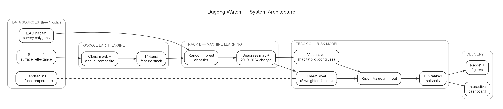
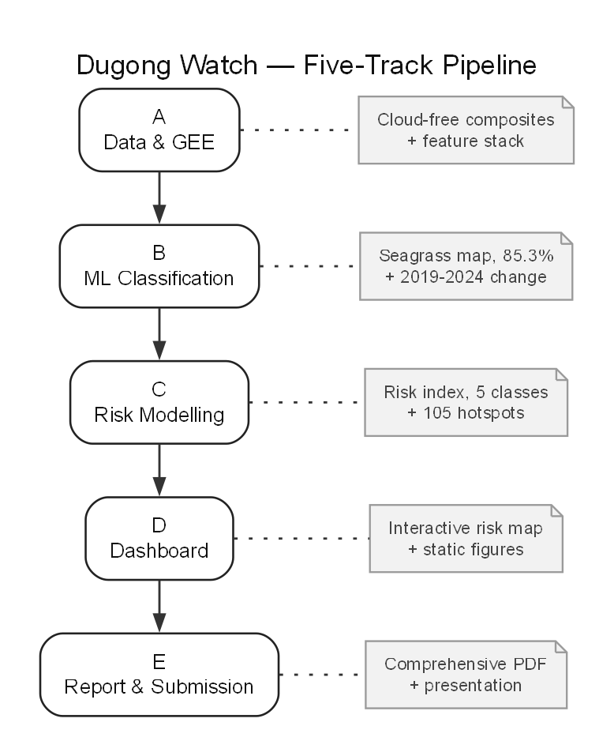
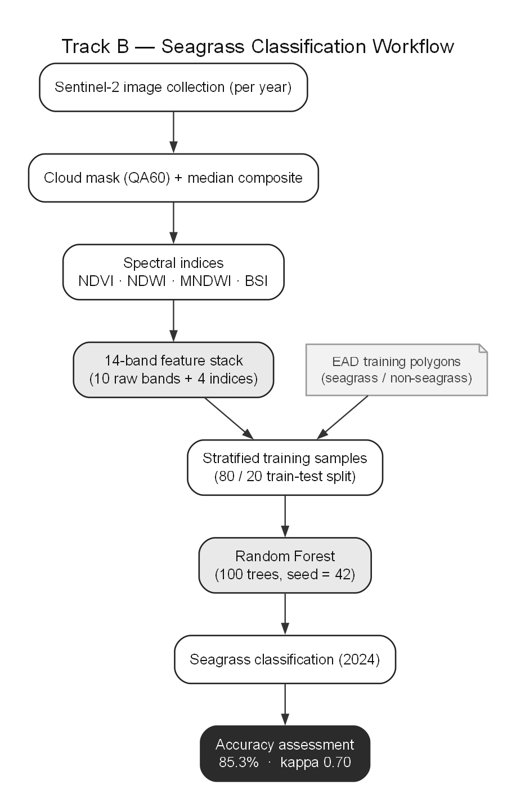
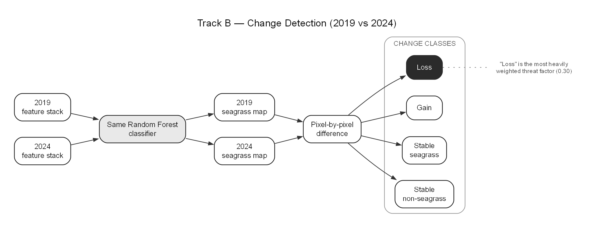
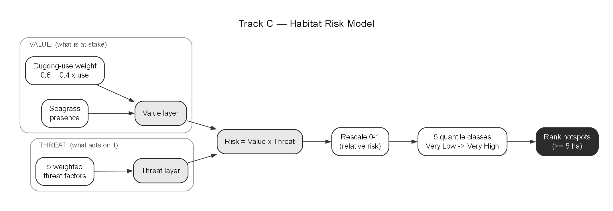
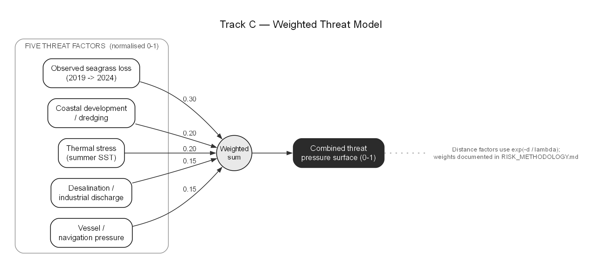

# Dugong Watch — Diagrams Explained

A detailed walk-through of the six architecture and flow diagrams. Each section
explains what the diagram shows, every component in it, how the pieces connect,
and *why* it is designed that way. All numbers are drawn from the project's own
notebooks and methodology documents — nothing here is illustrative.

---

## 1. System Architecture

### What it shows
The complete Dugong Watch system, from raw public data on the left to the
delivered products on the right. It is deliberately a **left-to-right data-flow
diagram**: every box is a real artefact, and every arrow is an actual transfer
of data from one stage to the next. The five grey containers correspond to the
five logical stages of the system — data sourcing, cloud processing, machine
learning, risk modelling, and delivery.

### Walkthrough
- **Data sources (free / public).** Three independent inputs. *Sentinel-2
  surface reflectance* (ESA, via Google Earth Engine) is the optical imagery
  used to see the seabed and classify seagrass. *Landsat 8/9 surface
  temperature* provides the thermal-stress signal. *EAD habitat survey polygons*
  (Environment Agency – Abu Dhabi) are the ground truth the model is trained and
  validated against. A core design decision is visible here: **every input is
  free and public**, which is what makes the whole pipeline reproducible at
  effectively zero data cost.
- **Google Earth Engine.** The imagery is cloud-masked and composited into one
  clean image per year, then reduced to a 14-band *feature stack* — the numeric
  representation each pixel is described by. Doing this inside Earth Engine
  means the heavy computation runs server-side, over the whole study area, with
  no data downloads.
- **Track B — machine learning.** A Random Forest classifier turns the feature
  stack into a *seagrass map*, and the same classifier applied across two years
  produces the *2019–2024 change* layer.
- **Track C — risk model.** The seagrass output feeds two parallel layers: a
  *value layer* (what habitat is at stake) and a *threat layer* (what pressure
  acts on it). The thermal input from Landsat feeds the threat layer directly
  (shown as a dashed line, because it bypasses the classification path). These
  combine as **Risk = Value × Threat**, which is then reduced to **105 ranked
  hotspots**.
- **Delivery.** The hotspots and underlying layers are surfaced two ways: an
  *interactive dashboard* and a *report with figures* (shown in solid black as
  the terminal outputs of the system).

### Why it is designed this way
The architecture separates concerns cleanly: data, processing, learning,
modelling, and delivery are independent stages that each hand a well-defined
product to the next. That modularity is what lets each track be reviewed,
re-run, or replaced on its own. The single most important structural choice is
that **habitat value and threat are computed as two separate layers and only
multiplied at the end** — this is what lets the system answer "where does
valuable habitat *and* real pressure coincide," rather than mapping either one
alone.

---

## 2. Five-Track Pipeline

### What it shows
The project's human and technical organisation as five sequential tracks
(A–E), each with a single clear deliverable (the note card to its right). Where
Diagram 1 shows *data* flowing through the system, this diagram shows *work*
flowing through the team: each track consumes the previous track's output and
produces the next one's input.

### Walkthrough
- **A — Data & GEE** → cloud-free composites and the feature stack. This is the
  foundation every later stage depends on.
- **B — ML Classification** → the seagrass map at **85.3%** accuracy plus the
  2019–2024 change layer. This is where raw pixels become a habitat map.
- **C — Risk Modelling** → the risk index (five classes) and **105 hotspots**.
  This is where a habitat map becomes a decision-relevant risk map.
- **D — Dashboard** → the interactive risk map and the static figures. This is
  where the result becomes usable by a non-technical stakeholder.
- **E — Report & Submission** → the comprehensive PDF and the presentation.
  This is where the work becomes communicable and auditable.

### Why it is designed this way
Each track has a defined owner and a defined hand-off, so the boundary between
"done" and "not done" is explicit at every stage. Reading the note cards top to
bottom is effectively a one-line summary of the entire project. The linearity is
intentional: nothing downstream can quietly depend on an unfinished upstream
step, which keeps the pipeline honest and reproducible.

---

## 3. Seagrass Classification Workflow (Track B)

### What it shows
The internal steps that turn a year of satellite imagery into a validated
seagrass map. It is a vertical top-to-bottom flow because it is a *procedure* —
each step must complete before the next can run.

### Walkthrough
- **Sentinel-2 image collection (per year).** All available scenes over the
  774.6 km² study area for the year (222 scenes contributed to the 2024
  composite).
- **Cloud mask (QA60) + median composite.** Cloud and cirrus pixels are removed
  using the QA60 band, and the remaining clear observations are collapsed into a
  single median image — robust to haze, glint, and transient artefacts.
- **Spectral indices — NDVI · NDWI · MNDWI · BSI.** Four indices are computed
  from the raw bands: a vegetation index (NDVI), two water indices (NDWI, MNDWI),
  and a bare-soil index (BSI). These sharpen the water-versus-vegetation contrast
  that seagrass classification depends on.
- **14-band feature stack.** The ten raw Sentinel-2 bands plus the four derived
  indices — the complete numeric description of each 10 m pixel (shown in grey
  as a key intermediate product).
- **EAD training polygons.** The official survey polygons (118 seagrass, 171
  non-seagrass), shown as a document/note because they are external reference
  data, not something the pipeline computes.
- **Stratified training samples (80/20 split).** Random points are drawn inside
  the polygons — *not* one point per polygon, because polygon sizes vary by
  orders of magnitude — and split 80% for training, 20% for testing.
- **Random Forest (100 trees, seed = 42).** The classifier itself. The fixed
  seed makes the result deterministic and exactly reproducible.
- **Seagrass classification (2024).** The trained model applied to the whole
  composite, producing the seagrass map.
- **Accuracy assessment — 85.3% · kappa 0.70.** The map is scored against the
  held-out test polygons (shown in solid black as the workflow's verified
  output). 85.3% sits inside the 73–87% range reported for comparable
  satellite seagrass methods.

### Why it is designed this way
Two design choices carry the most weight. First, **the model is anchored to real
survey data** at both ends — trained on EAD polygons and scored against a
held-out portion of them — so accuracy is measured against reality, not
asserted. Second, **the feature engineering front-loads physics into the
model**: the four indices give the Random Forest inputs that already separate
water from vegetation, which is why a relatively simple, interpretable model
reaches strong accuracy on a small (~1,000-sample) dataset.

---

## 4. Change Detection (2019 vs 2024)

### What it shows
How seagrass *change* over time is derived. Two feature stacks (2019 and 2024)
converge on **one** classifier, produce two maps, and are differenced into four
change classes.

### Walkthrough
- **2019 feature stack** and **2024 feature stack.** The same 14-band
  representation built for each of the two years.
- **Same Random Forest classifier.** The single most important node in the
  diagram, and the reason both arrows point to one box. The classifier is
  trained once and applied unchanged to both years.
- **2019 seagrass map** and **2024 seagrass map.** The two classified rasters.
- **Pixel-by-pixel difference.** The two maps are compared cell by cell.
- **Change classes.** Every pixel falls into one of four categories: *stable
  non-seagrass*, *stable seagrass*, *gain* (became seagrass), or *loss* (was
  seagrass, now gone — shown in solid black). The side note records that "loss"
  becomes the **most heavily weighted threat factor (0.30)** in the risk model.

### Why it is designed this way
Using the **same classifier for both years** is the critical methodological
decision, and the diagram is drawn specifically to make it obvious. If two
different models were trained, any difference between the maps could be model
drift rather than real change on the ground. By fixing the model, every
difference is attributable to the imagery — i.e. to actual habitat change. The
diagram also flags the honest dependency: because "loss" is both derived from
the classifier *and* the highest-weighted threat, any classification error is
compounded there, so loss-dominated hotspots must be read alongside the accuracy
figures.

---

## 5. Habitat Risk Model (Track C)

### What it shows
The core logic of the risk index: two independent layers — **Value** and
**Threat** — are built separately and then multiplied, rescaled, classified, and
ranked. The two grey containers on the left make the separation explicit.

### Walkthrough
- **Value (what is at stake).** Built from *seagrass presence* (from the
  classification) multiplied by a *dugong-use weight* of the form
  `0.6 + 0.4 × use`. The result is the *value layer*: every seagrass pixel keeps
  a baseline value of 0.6 (because the whole reserve is prime habitat), rising to
  1.0 where dugong use is highest — so core habitat is weighted up to ~1.7× more
  than reserve-edge habitat.
- **Threat (what acts on it).** The five weighted threat factors (detailed in
  Diagram 6) collapse into a single *threat layer*.
- **Risk = Value × Threat.** The two layers are multiplied. Because value is
  ~0 wherever there is no seagrass, threat over bare seabed contributes nothing —
  a location scores high **only** when valuable habitat and real pressure
  coincide.
- **Rescale 0–1 (relative risk).** The raw product is normalised across the
  study area into a relative index.
- **5 quantile classes (Very Low → Very High).** The continuous index is binned
  into five ranked classes using quantile breaks computed over seagrass pixels
  only (non-seagrass has nothing at stake by construction).
- **Rank hotspots (≥ 5 ha).** Contiguous top-class patches of at least 5 ha are
  extracted and ranked — the 105 concrete locations that are the system's headline
  output (shown in solid black).

### Why it is designed this way
The structure is an **exposure × consequence** model (after Halpern et al. 2008
and the InVEST Habitat Risk Assessment framework): risk is the product of what is
valuable and what threatens it, never one alone. Keeping Value and Threat as
separate, inspectable layers is what makes the model auditable — you can look at
either input on its own and ask whether it is reasonable. The multiplication is
the single design decision that makes the output *dugong-specific* rather than a
generic habitat map or a generic pressure map.

---

## 6. Weighted Threat Model (Track C)

### What it shows
How the single "threat" layer used in Diagram 5 is actually built: five
normalised factors, each with an explicit weight, summed into one combined
pressure surface. The weights on the arrows (0.30 / 0.20 / 0.20 / 0.15 / 0.15)
sum to 1.0.

### Walkthrough
- **Observed seagrass loss (2019 → 2024), weight 0.30.** The measured "loss"
  layer from Diagram 4, smoothed into a continuous pressure surface. It carries
  the highest weight because *measured* decline is the strongest evidence that
  habitat is already failing.
- **Coastal development / dredging, weight 0.20.** Distance-decayed pressure from
  mapped development points.
- **Thermal stress (summer SST), weight 0.20.** Landsat summer surface
  temperature, water-masked so hot dry land cannot skew the signal.
- **Desalination / industrial discharge, weight 0.15.** Distance-decayed pressure
  from mapped outfalls (e.g. the Mirfa plant).
- **Vessel / navigation pressure, weight 0.15.** Distance-decayed pressure from
  ports, landings, and navigation routes through the shallow reserve.
- **Weighted sum.** The five normalised factors are combined in proportion to
  their weights.
- **Combined threat pressure surface (0–1).** The single output that feeds the
  threat layer in the risk model (shown in solid black).

### Why it is designed this way
Every factor is first **normalised to 0–1** so that quantities measured in
completely different units (temperature, distances, change density) can be
combined fairly. The distance-based factors use an exponential decay,
`exp(-d / λ)`, so that a pressure source's influence falls off smoothly with
distance — which correctly makes far-away regional plants contribute almost
nothing while nearby sources register strongly. Most importantly, **the weights
are visible, documented parameters, not hidden coefficients**: they are stated
in `RISK_METHODOLOGY.md`, and the project's weight-sensitivity test shows that
perturbing any of them by ±10% changes the flagged high-risk area by no more than
3% — so the ranking is robust to the exact weighting chosen.

---

## Design philosophy across all six diagrams

Three principles recur throughout:

1. **Separation before combination.** Value and threat, and the five threat
   factors, are each built and inspectable on their own before anything is
   multiplied or summed. This is what makes the model auditable rather than a
   black box.
2. **Anchored to real data.** The classification is trained and scored against
   official EAD survey polygons; the change layer uses one fixed classifier so
   difference means real change; the threat factors are tied to real coordinates
   and documented weights.
3. **Free and reproducible end to end.** Every input is public, every step is
   code, and every parameter is written down — so any result can be reproduced,
   challenged, or re-run on new imagery at effectively zero marginal cost.
