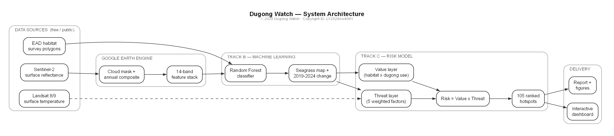

# Executive Summary

A dugong can live for seventy years and spend almost all of them grazing
seagrass in shallow water. The Arabian Gulf holds the world's second-largest
dugong population (~3,000–3,500), concentrated in Abu Dhabi's UNESCO-designated
Marawah / Bu Tinah reserve — yet the seagrass they depend on is under pressure
from coastal development, dredging, desalination discharge, marine heat, and
vessel traffic.

**Dugong Watch** answers a question conservation planners currently cannot: not
"where is there seagrass," but *where is seagrass both present and under enough
pressure that its loss would matter for dugongs* — so limited protection
resources can be aimed first. It is an end-to-end, open pipeline built on free
satellite data: a Random Forest classifier maps seagrass from Sentinel-2 at
**85.3% accuracy**, change is detected between 2019 and 2024, and habitat value
is combined with five weighted threat factors into one risk index
(`Risk = Value × Threat`), yielding **105 ranked hotspots** delivered through an
interactive dashboard.

The output is validated three ways: risk falls with distance from real pressure,
is **3× higher inside the documented dugong core** than reserve-wide, and shifts
by ≤3% when any weight is perturbed ±10%. Every input is free and public and
every step is code, so it re-runs at near-zero cost as new imagery arrives — and
the same structure transfers to other satellite-visible, single-species habitats
worldwide.

# 1. Introduction & Problem Statement

## 1.1 Background

The dugong (*Dugong dugon*) feeds almost exclusively on seagrass: protect the
meadows and you protect the animal; lose them and it has nowhere left to feed.
The Arabian Gulf population, centred on Abu Dhabi, is the world's second-largest
after Australia's (~3,000–3,500 individuals), and the Marawah Marine Biosphere
Reserve holds its highest concentration.

That seagrass is under measurable pressure: coastal development and dredging,
desalination and industrial discharge, marine heatwaves in one of the hottest
seas on Earth, and vessel traffic in the shallow (<5 m) waters where dugongs
feed. Planning in the region therefore needs a specific answer — not "where is
there seagrass," but **where is seagrass both present and under enough pressure
that its loss would matter for dugong survival**.

## 1.2 Problem statement

Answering that means combining three things rarely brought together: habitat
maps (where seagrass is), habitat change (whether it is being lost), and threat
data (what pressures act where). Habitat surveys are episodic and expensive;
threat data is scattered and non-standardised; and there is no publicly
available, reproducible model that fuses these into a ranked map of *risk to
dugong habitat specifically* — as opposed to generic seagrass extent maps or
generic risk indices not conditioned on dugong presence. What planners actually
need is a transparent, updatable answer to "if we can only act in a few places,
where first?"

## 1.3 Project objective

**Dugong Watch** is an end-to-end, reproducible pipeline that (1) classifies
seagrass from free Sentinel-2 imagery with a model trained and validated on
official EAD habitat surveys; (2) detects seagrass change between two periods;
(3) combines habitat with five geographically specific threat factors — observed
loss, coastal development, thermal stress, desalination discharge, and vessel
pressure — into one weighted, explicitly justified risk index; and (4) surfaces
the result as a ranked, interactive map, alongside the code and data so every
step can be audited or reproduced.

The guiding principle is **transparency over sophistication**: every weight is a
documented parameter, every threat layer's provenance is labelled, and the
model's sensitivity to its assumptions is tested, not assumed.

## 1.4 Scope

The project covers the Marawah / Bu Tinah region of the Arabian Gulf, comparing
2019 and 2024 (the best cloud-free Sentinel-2 coverage). Classification is
binary (`1 = seagrass`, `0 = non-seagrass`), matching the EAD training data. The
risk index is explicitly **relative** — it ranks locations within the study area
against each other, not against an absolute probability of habitat loss.
