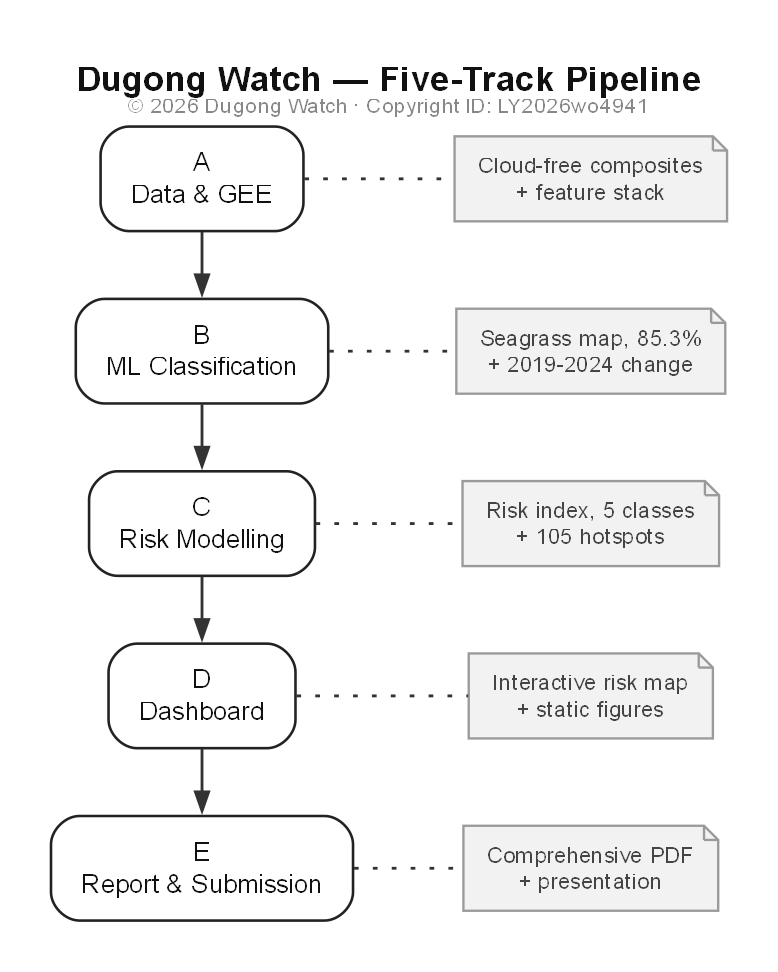
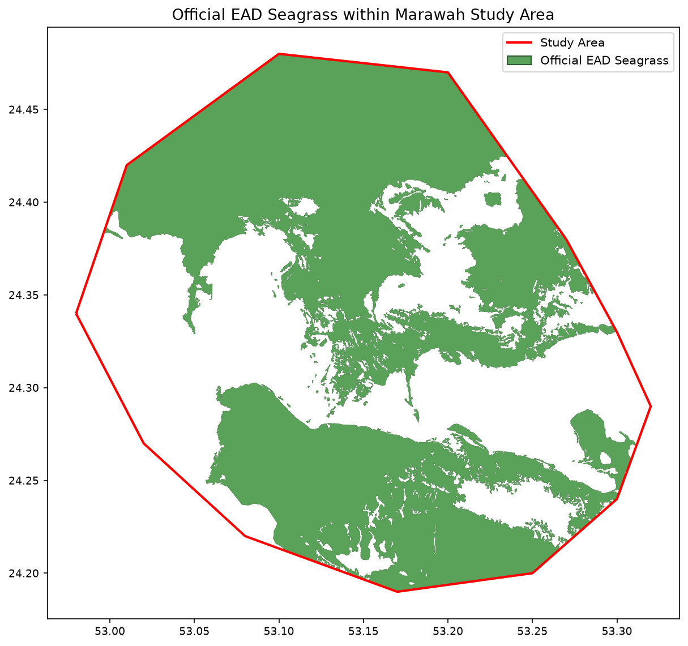
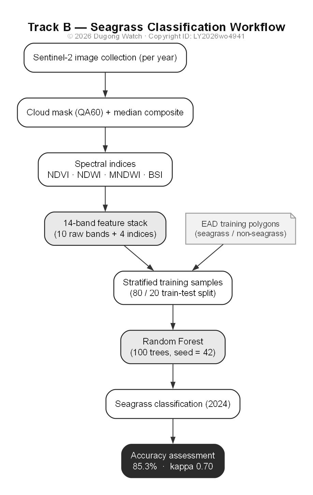
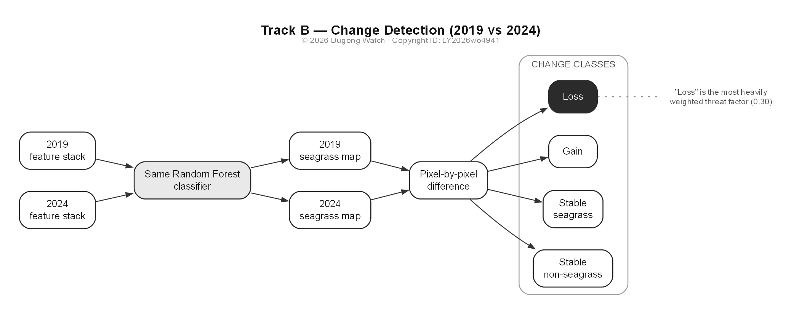
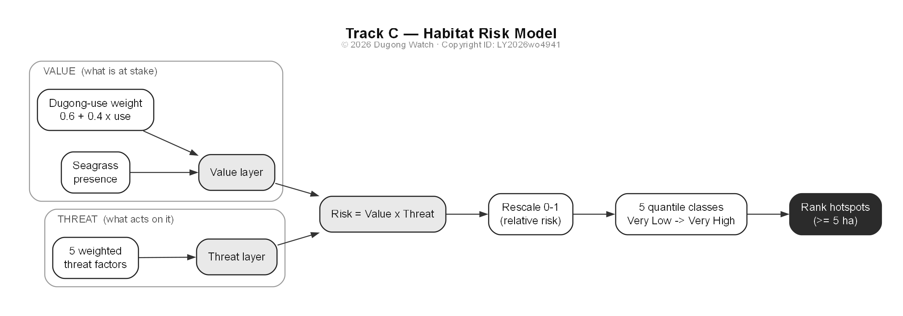
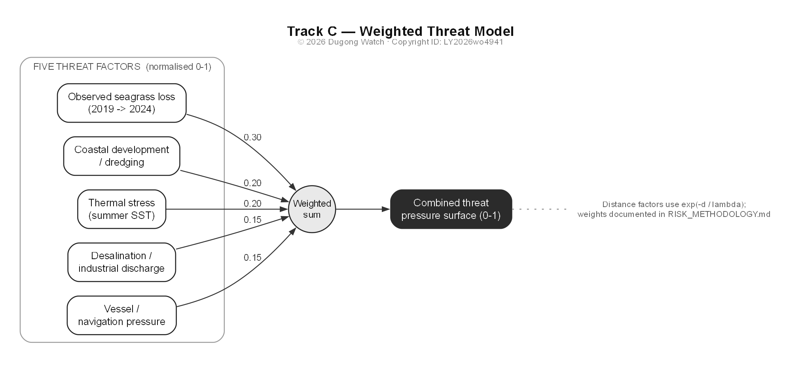

# 3. Methodology

Every number below is drawn directly from the project's two notebooks
(`M2_classification/Seagrass_Dugong_Mapping.ipynb` for classification and
`C_risk_gis/Dugong_Habitat_Risk.ipynb` for the risk model), both run against
live data and verified.



## 3.1 Study area and data

The study area is a 774.6 km² polygon over the Marawah / Bu Tinah region of the
Arabian Gulf (lon 52.98–53.32, lat 24.19–24.48), entirely inside the Marawah
Marine Biosphere Reserve.

- **Satellite imagery:** Sentinel-2 Surface Reflectance
  (`COPERNICUS/S2_SR_HARMONIZED`) via Google Earth Engine, cloud-masked (QA60)
  and median-composited per year; 222 scenes built the 2024 composite.
  Composites for 2019 and 2024 are compared.
- **Thermal data:** Landsat 8/9 summer surface temperature (`ST_B10`,
  June–September), converted to Celsius and water-masked so hot dry land cannot
  skew the signal.
- **Training and reference data (EAD):** 118 seagrass and 171 non-seagrass
  polygons for training; a separate 118-polygon seagrass layer for independent
  validation; and a 1,954-polygon regional layer for context only.

The binary scheme (`1 = seagrass`, `0 = non-seagrass`) matches the EAD training
data.



## 3.2 Seagrass classification (Track B)

Each composite is reduced to **14 predictor bands** — ten raw Sentinel-2 bands
(B2–B12) plus four spectral indices (NDVI, NDWI, MNDWI, BSI). Stratified random
points inside the training polygons (not one per polygon, since sizes vary up to
~61 km²) supply each point's 14 band values at 10 m. A **Random Forest**
(`ee.Classifier.smileRandomForest`, 100 trees, fixed seed) is trained on an
80/20 split; a class-balanced version outperformed the imbalanced one on every
metric (Section 4) and is used downstream. For **change detection**, the same
trained classifier is applied to both 2019 and 2024 (not retrained per period,
so differences reflect real change, not model drift), and the two maps are
differenced into four classes: stable non-seagrass, stable seagrass, gain, and
loss.





## 3.3 Habitat-risk model (Track C)

The model follows an **exposure × consequence** structure (Section 2.2):
`Risk = Value × Threat`, so a location scores high only when valuable habitat and
real pressure coincide.

**Value (what is at stake):**
```
Value = SeagrassPresence × (0.6 + 0.4 × DugongUse)
```
`SeagrassPresence` comes from the 2024 classification; `DugongUse` is a 0–1
distance-decay surface from documented high-density anchors (Marawah core, Bu
Tinah, central foraging grounds), so core seagrass is weighted up to ~1.7× more
than reserve-edge seagrass while every reserve pixel keeps some value.

**Threat (what acts on it)** — a weighted sum of five normalised (0–1) factors:

| Factor | Measured as | Weight |
|---|---|:---:|
| Observed seagrass loss (2019→2024) | Smoothed density of "loss" change pixels | 0.30 |
| Coastal development / dredging | Distance decay from mapped development points | 0.20 |
| Thermal stress | Landsat summer surface temperature, water-masked | 0.20 |
| Desalination / industrial discharge | Distance decay from mapped discharge points | 0.15 |
| Vessel / navigation pressure | Distance decay from ports, landings, routes | 0.15 |

Distance factors use `exp(−distance/λ)` with factor-specific decay lengths
(λ ≈ 3–5 km), so distant regional plants contribute almost nothing while the
nearer Mirfa plant registers on the reserve's south-east flank. Built-
infrastructure coordinates are real; the reserve boundary, dugong-density
surface, and navigation routes are documented approximations pending official
EAD GIS layers. `Risk = Value × Threat` is rescaled 0–1 and binned into five
classes (Very Low → Very High) using quantile breaks over seagrass pixels only.





## 3.4 Validation approach

Beyond standard accuracy metrics, three checks test whether the risk output is
trustworthy rather than an artefact of its parameters (results in Section
4.3–4.4): (1) **face validity** — does risk fall with distance from a real
discharge point; (2) **zonal comparison** — is risk inside the dugong core higher
than reserve-wide; and (3) **weight sensitivity** — do the hotspots survive
perturbing each weight ±10%.

## 3.5 Implementation and reproducibility

The whole pipeline runs in Google Earth Engine via Python (`earthengine-api`,
`geemap`). Both notebooks re-run end-to-end using only the vector data committed
to the repository plus Earth Engine's public Sentinel-2 / Landsat archives — no
proprietary or purchased data anywhere.
