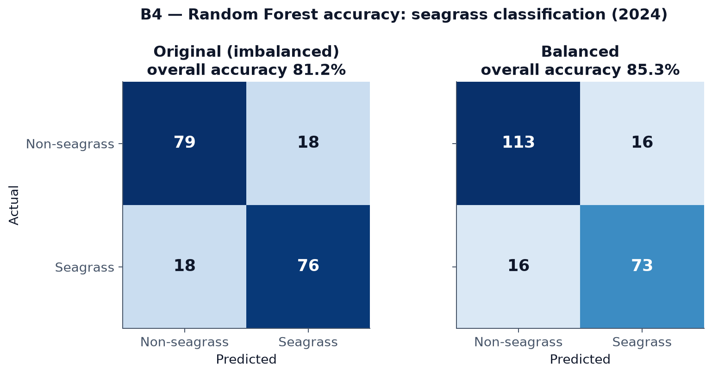
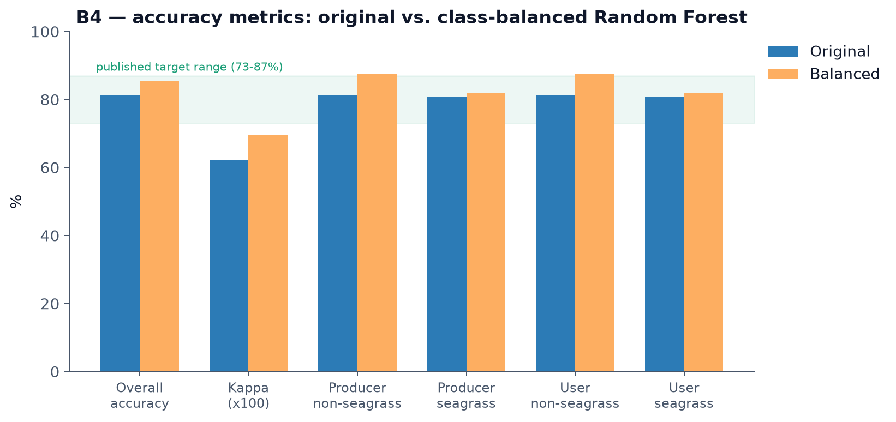
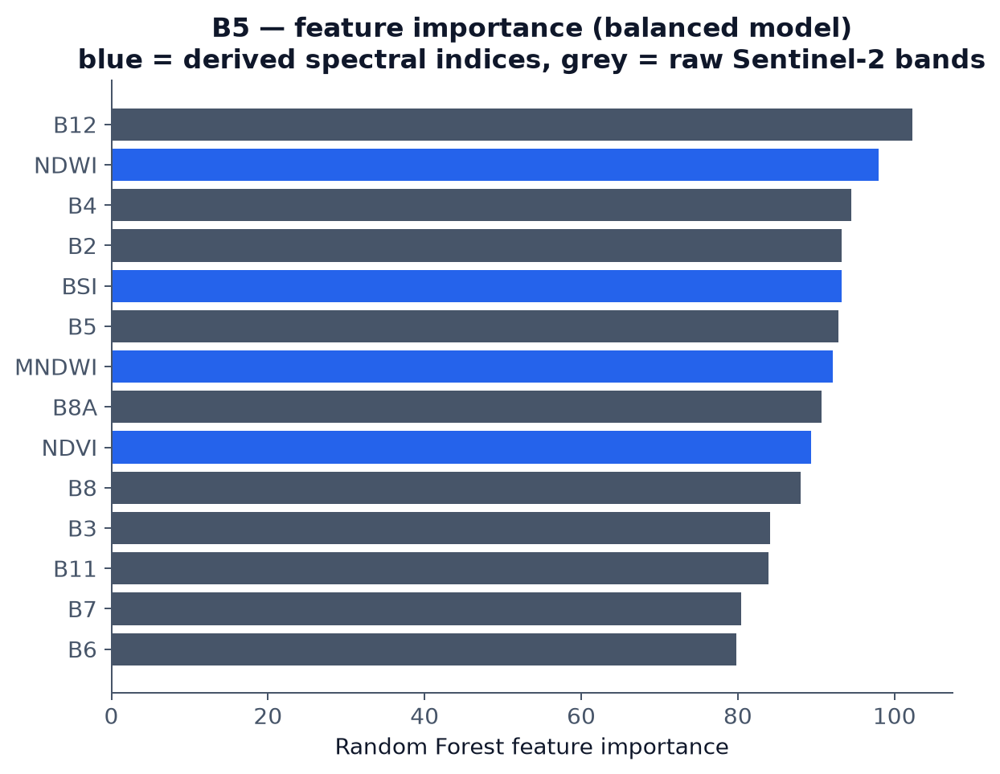
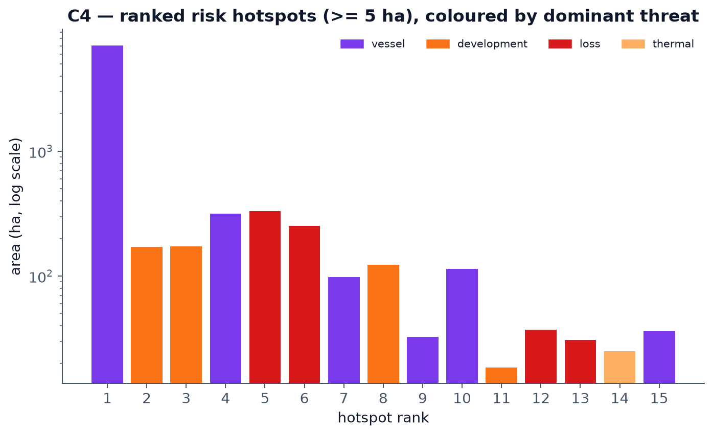
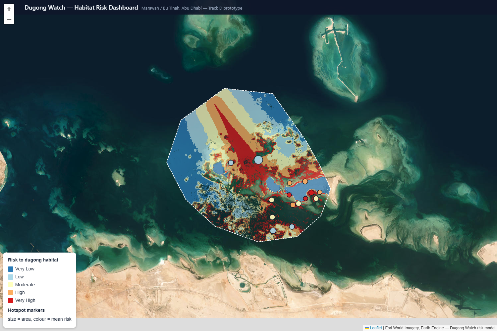
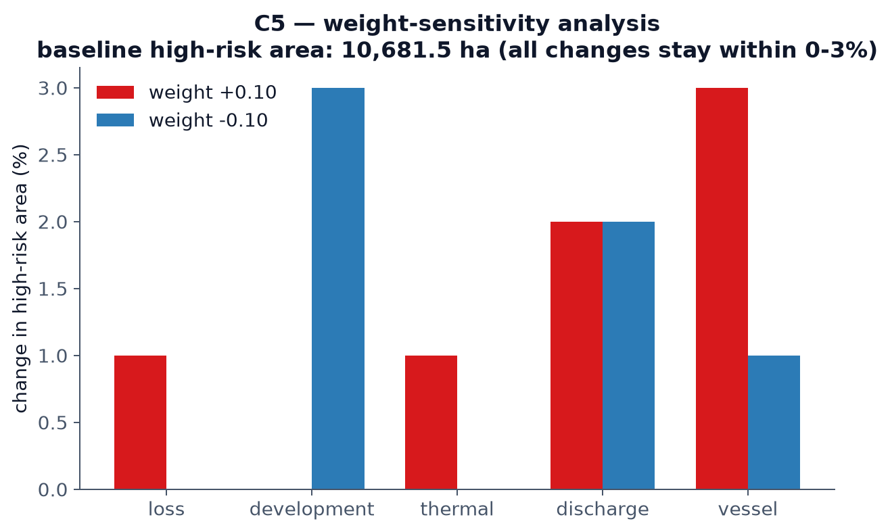

# 4. Results

All figures referenced below are in `D_dashboard/figures/` and were
generated directly from these results, not illustratively.

## 4.1 Seagrass classification accuracy

Two Random Forest models were trained and compared (see Section 3.2):

| Metric | Original (imbalanced) | Class-balanced |
|---|:---:|:---:|
| Overall accuracy | 81.15% | **85.32%** |
| Kappa | 0.623 | 0.696 |
| Producer's accuracy (non-seagrass) | 81.44% | 87.60% |
| Producer's accuracy (seagrass) | 80.85% | 82.02% |
| User's accuracy (non-seagrass) | 81.44% | 87.60% |
| User's accuracy (seagrass) | 80.85% | 82.02% |

Both models fall within the published 73–87% accuracy range reported for
comparable satellite-based seagrass classification methods; the
class-balanced model is used for all subsequent risk modelling.

**Feature importance** (balanced model, highest to lowest): B12 (SWIR),
NDWI, B4 (red), B2 (blue), BSI, B5 (red edge), MNDWI, B8A (narrow NIR),
NDVI, B8 (NIR), B3 (green), B11 (SWIR), B7 (red edge), B6 (red edge). Water-
and vegetation-index bands (NDWI, BSI, MNDWI, NDVI) rank among the most
important features alongside the raw shortwave-infrared band B12,
consistent with seagrass discrimination depending on both spectral water
characteristics and vegetation signal.

## 4.2 Habitat-risk index

Applying the risk model (Section 3.3) across the 774.6 km² study area
produced:

- **Risk class breaks** (quantile boundaries over seagrass pixels, on a
  0–1 scale): 0.049 / 0.092 / 0.158 / 0.24, separating the five ranked
  classes from Very Low to Very High risk.
- **105 ranked hotspot patches** (≥5 ha, top risk class), ranging from
  18.5 ha to 7,048.9 ha, with mean risk values from 0.293 to 0.659 across
  the top 15 ranked hotspots. The single largest hotspot (7,048.9 ha,
  vessel-dominated) reflects one contiguous high-pressure zone rather than
  a data artefact; smaller, higher-mean-risk hotspots are dominated by
  development and observed-loss pressure.
- Across the top 15 hotspots, the dominant threat factor was vessel
  pressure (6 of 15), coastal development (4 of 15), observed loss (4 of
  15), and thermal stress (1 of 15).

## 4.3 Model validation

**Face validity:** mean risk fell from approximately 0.26 near the nearest
industrial discharge point (20 km distance band) to approximately 0.09–0.14
at 40–48 km — a real, if not perfectly monotonic, decline consistent with
the model's own distance-decay construction (some non-monotonicity at
24–28 km is expected given real coastal geometry and other overlapping
threat sources).

**Zonal comparison:** mean risk over seagrass pixels inside the documented
dugong core was **0.461**, versus **0.153** across the whole study area —
roughly **3× higher** inside the core. This is the result the model should
produce if it is correctly identifying valuable habitat under real pressure
specifically where dugongs are known to concentrate, rather than flagging
risk uniformly or at random locations.

## 4.4 Weight-sensitivity analysis

Each of the five threat weights was independently perturbed by ±0.10 (and
re-normalized so weights still summed to 1.0), and the resulting high-risk
area was recomputed for each perturbation:

| Weight perturbed | +0.10 | −0.10 |
|---|:---:|:---:|
| Observed loss | +1% | +0% |
| Coastal development | −0% | +3% |
| Thermal stress | +1% | +0% |
| Discharge | +2% | +2% |
| Vessel pressure | +3% | +1% |

Baseline high-risk area: 10,681.5 ha. Every perturbation changed the
high-risk area by no more than 3%, indicating the model's ranked hotspots
are robust to the exact weighting chosen and not an artefact of one
specific set of assumptions.

## 4.5 Delivered outputs

The full pipeline exports, per run: a 5-class risk map
(`dugong_risk_class.tif`), a continuous risk index
(`dugong_risk_index.tif`), the underlying value and threat layers for
drill-down analysis, a ranked hotspot vector layer
(`dugong_risk_hotspots.geojson`), and the five threat context layers used as
inputs — all consumed directly by the interactive dashboard described in
Section 5 / `D_dashboard/`.
