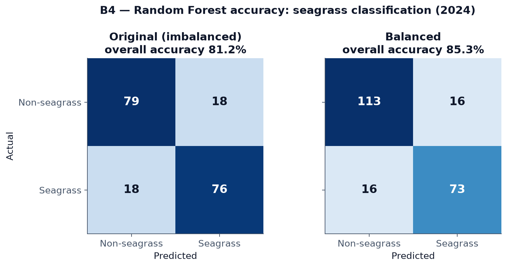
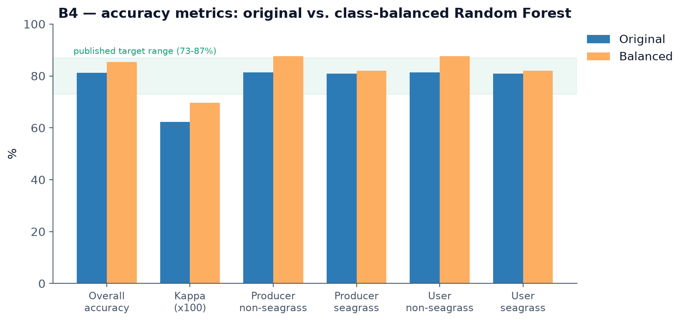
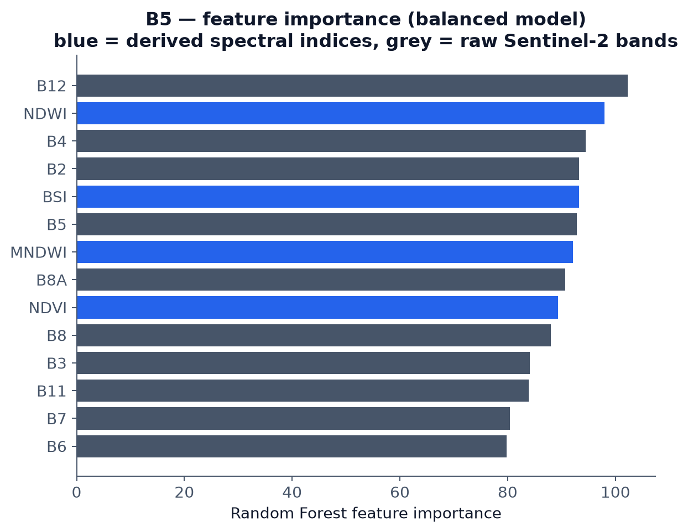
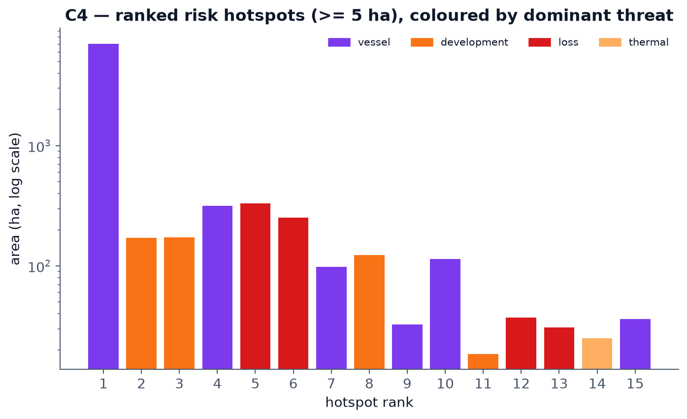
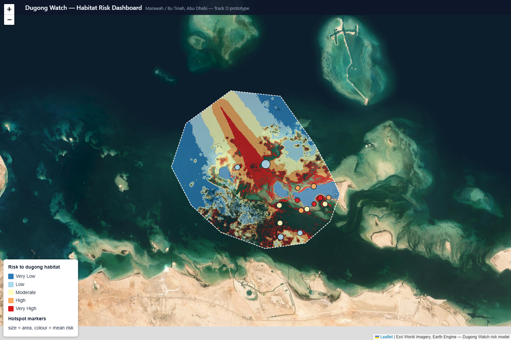
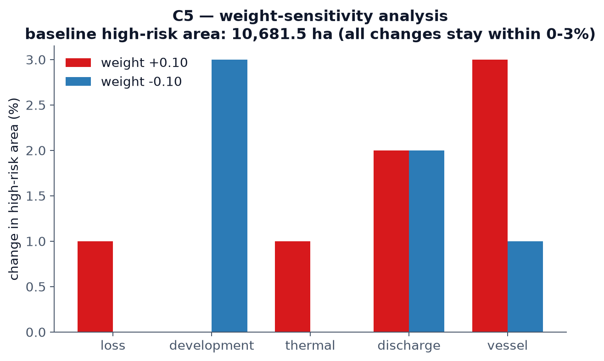

# 4. Results

All figures are generated directly from these results, not illustratively.

## 4.1 Seagrass classification accuracy

Two Random Forest models were compared (Section 3.2):

| Metric | Original (imbalanced) | Class-balanced |
|---|:---:|:---:|
| Overall accuracy | 81.15% | **85.32%** |
| Kappa | 0.623 | 0.696 |
| Producer's accuracy (non-seagrass) | 81.44% | 87.60% |
| Producer's accuracy (seagrass) | 80.85% | 82.02% |
| User's accuracy (non-seagrass) | 81.44% | 87.60% |
| User's accuracy (seagrass) | 80.85% | 82.02% |

Both fall within the published 73–87% range for comparable satellite seagrass
methods; the class-balanced model is used for all risk modelling.

**Feature importance** (balanced model, high to low): B12, NDWI, B4, B2, BSI,
B5, MNDWI, B8A, NDVI, B8, B3, B11, B7, B6. Water- and vegetation-index bands
(NDWI, BSI, MNDWI, NDVI) rank among the most important alongside the
shortwave-infrared band B12 — consistent with seagrass discrimination depending
on both spectral water characteristics and vegetation signal.

## 4.2 Habitat-risk index

Across the 774.6 km² study area the model produced:

- **Risk class breaks** (quantiles over seagrass pixels, 0–1 scale): 0.049 /
  0.092 / 0.158 / 0.24, separating Very Low to Very High.
- **105 ranked hotspots** (≥5 ha, top class), from 18.5 to 7,048.9 ha, mean risk
  0.293–0.659 across the top 15. The largest (7,048.9 ha, vessel-dominated) is
  one contiguous high-pressure zone rather than an artefact; smaller,
  higher-mean-risk hotspots are development- and loss-dominated.
- Dominant threat across the top 15: vessel pressure (6), coastal development
  (4), observed loss (4), thermal stress (1).

## 4.3 Model validation

**Face validity:** mean risk fell from ~0.26 near the nearest discharge point
(20 km band) to ~0.09–0.14 at 40–48 km — a real decline consistent with the
model's distance-decay construction.

**Zonal comparison:** mean risk over seagrass inside the documented dugong core
was **0.461** versus **0.153** reserve-wide — roughly **3× higher** in the core.
This is the result a correct model should produce: risk concentrating where
dugongs actually are, not uniformly or at random.

## 4.4 Weight-sensitivity analysis

Each weight was perturbed ±0.10 (re-normalised to sum to 1.0) and the high-risk
area recomputed:

| Weight perturbed | +0.10 | −0.10 |
|---|:---:|:---:|
| Observed loss | +1% | +0% |
| Coastal development | −0% | +3% |
| Thermal stress | +1% | +0% |
| Discharge | +2% | +2% |
| Vessel pressure | +3% | +1% |

Baseline high-risk area: 10,681.5 ha. No perturbation moved it by more than 3% —
the ranked hotspots are robust to the exact weighting, not an artefact of one set
of assumptions.

## 4.5 Delivered outputs

Per run the pipeline exports a 5-class risk map, a continuous risk index, the
underlying value and threat layers, a ranked hotspot vector layer, and the five
threat context layers — all consumed directly by the interactive dashboard
(Section 5).
